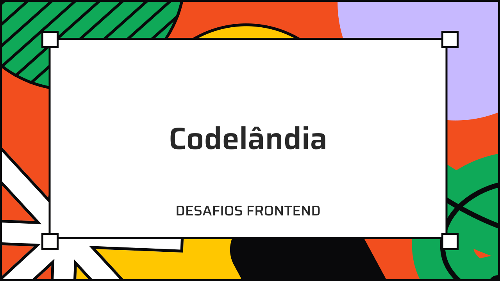

<div id="top" align="center">

<div align="center">
  
</div>

<br>

Minhas Redes Sociais. <br>
<a href="https://www.linkedin.com/in/paulopbi/" target="_blank">Linkedin</a> •
<a href="https://github.com/paulopbi" target="_blank">Github</a> •
<a href="https://www.behance.net/paulopbi" target="_blank">Behance</a>

</div>

## Créditos

Este repositório contém todas as páginas do desafio "Codelândia" criada pelo desenvolvedor **[Iuri Silva](https://www.instagram.com/iuricode/), os créditos são todos dele!** Eu apenas fiz os códigos, os links para as redes sociais do Iuri estão logo abaixo: <br>

- [Github](https://github.com/iuricode)
- [Instagram](https://www.instagram.com/iuricode/)
- [Linkedin](https://www.linkedin.com/in/iuricode)
- [Comunidade no Discord](https://discord.com/invite/QevDJqCzaY)

## Sobre

Codelândia são desafios frontend onde você tem um design e precisa reproduzir a interface com codigo. Eu fiz esse projeto usando apenas **HTML / CSS**, mas você pode usar a tecnologia que quiser.

A intenção deste repositorio e ajudar quem esta com dificuldades para desenvolver as interfaces, você pode tanto ver o código aqui no Github como baixar os arquivos e testar na sua maquina!

## Como começar

Você pode fazer um clone do projeto ou baixar o zip clicando no botão verde "Code".

#### 1. Clone o repositório

Escreva o código abaixo no seu Terminal / Git Bash

```bash
git clone git@github.com:paulopbi/codelandia.git
```

#### 2. Entre na pasta do projeto

Depois de ter baixado o repositório, é só navegar para a pasta do projeto.

```bash
cd codelandia
```

E pronto, todos os arquivos estarão dentro dessa pasta.

## Estrutura do projeto

Cada pasta terá o número e nome do desafio, assim fica mais fácil de saber qual desafio é, a estrutura de pastas fica assim:

- **public**: pasta com os arquivos publicos
- **desafios**: pasta que ficarão todos os desafios
- **00_nome_do_desafio**: pasta com o nome dos desafios e arquivos dos mesmos.
- **assets**: contem todas as imagens necessárias.
- **css**: contem os arquivos css.
- **index.html**: contem o código html.

## Contribuição

Caso queira contribuir com esse projeto faça um fork e quando completar algum desafio faça um pull request.

> Quando for fazer fazer algum commit, o padrão conventinal commits para manter a organização do projeto.

[conventional commits documentação](https://www.conventionalcommits.org/en/v1.0.0/)

## Desafios

Quais desafios foram finalizados até o momento.

| Desafio            | Status        | Design                                           |
| ------------------ | ------------- | ------------------------------------------------ |
| 01 - Blog          | Finalizado ✅ | [Demonstração](./public/design/Blog.jpg)         |
| 02 - JordanShoes   | Finalizado ✅ | [Demonstração](./public/design/JordanShoes.jpg)  |
| 03 - TechBlog      | Finalizado ✅ | [Demonstração](./public/design/TechBlog.jpg)     |
| 04 - Login         | Finalizado ✅ | [Demonstração](./public/design/Login.jpg)        |
| 05 - Studio Ghibli | Finalizado ✅ | [Demonstração](./public/design/StudioGhibli.jpg) |
| 06 - Mefolio       | Finalizado ✅ | [Demonstração](./public/design/Mefolio.jpg)      |

## Contato

Onde me encontrar ou fazer contato.

**Email**: paulovictordev16@gmail.com <br>
**Linkedin**: https://www.linkedin.com/in/paulopbi/ <br>
**Github**: https://github.com/paulopbi <br>
**Portfólio**: https://paulopbi.github.io/portfolio/ <br>

<br>

<a href="#top">Voltar para o início</a>
