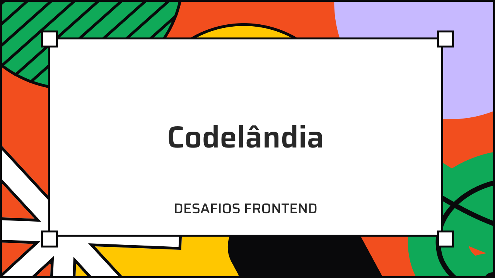
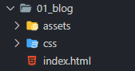

<div id="top" align="center">

<div align="center">

</div>

<br>

Páginas do desafio "Codelandia" finalizadas.

<a href="https://www.linkedin.com/in/paulopbi/" target="_blank">Linkedin</a> •
<a href="https://github.com/paulopbi" target="_blank">Github</a> •
<a href="https://www.behance.net/paulopbi" target="_blank">Behance</a>
</div>

## Créditos 

Este repositório contém todas as paginas do desafio "codelandia" criada pelo desenvolvedor **<a href="https://www.instagram.com/iuricode/">"Iuri Silva"</a>, os créditos sao todos dele!** Eu apenas fiz os codigos, os links para as redes sociais do Iuri estão logo abaixo: <br>

- Github: https://github.com/iuricode
- Instagram: https://www.instagram.com/iuricode/
- Linkedin: https://www.linkedin.com/in/iuricode
- Comunidade no Discord: https://discord.com/invite/QevDJqCzaY

## Sobre 
Codelandia são desafios frontend onde você tem um design e precisa reproduzir a interface. Eu fiz esse projeto usando apenas **HTML / CSS**, mas você pode usar a tecnologia que quiser! <br>

A intenção deste repositorio e ajudar quem esta com dificuldades para desenvolver as interfaces, você pode tanto ver o código aqui no Github como baixar os arquivos e testar na sua maquina!

## Como começar

Você pode fazer um clone do projeto ou baixar o zip clicando no botão verde "Code".

### Fazendo o clone 

Escreva o código abaixo no seu Terminal / Git Bash

```
git@github.com:paulopbi/codelandia.git
```

Depois de ter baixado e so abrir o arquivo index.html e vizualizar o projeto.

## Estrutura do projeto

Cada pasta tera o numero e nome do desafio, assim fica mais facil de saber qual desafio e. 
A estrutura fica assim: 



- 01_nome_do_desafio
  - assets
  - css
  - index.html

Legenda

- Nome do desafio: pasta contendo cada desafio.

- Assets: tera todos os arquivos que nao sao codigos (imagens).

- Css: o css do projeto

- Index.html: o html do projeto

## Deploy

Algumas paginas sera feito o deploy para voce poder vizualizar a versao final.

[01_blog](https://blog-codelandia-gamma.vercel.app/)

## Contato

> Para a remocao de conteudo entre em contato pelas redes abaixo.

- [Linkedin](https://www.linkedin.com/in/paulopbi/) 

- [Github](https://github.com/paulopbi)

- [Behance](https://www.behance.net/paulopbi)

- [Instagram](https://www.instagram.com/paulopbi_/)